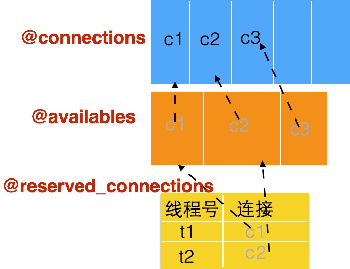

 #+TITLE: How to use activerecord

 #+KEYS: mysql,index

 #+DATE: <2015-04-28 Tue>

 #+AUTHOR: Chen Sun

 #+description: 使用activerecord和数据库交互


###如何在rails之外使用activerecord?
* * *

#### 1. load config

```
config = YAML.load( File.read('./config/database.yml'))
```

#### 2. 初始化adapter

adapter指不同数据库的适配器，比如mysql2-adapter. 根据配置中的数据库类型和信息初始化adapter

```
ActiveRecord::Base.establish_connection(config['development'])
```

1)断开和数据库的连接

2)初始化连接池：根据配置初始化数据，包括重要的

* @available：当前可用的连接们

* @connections：所有建立的连接们

* `@reserved_connections = ThreadSafe::Cache.new(:initial_capacity => @size)` ：缓存线程号和连接的映射关系

#### 查询

继承ActiveRecord::Base, 设置 `table_name` 即可完成modle与数据库表的映射

```ruby
class Residential < ActiveRecord::Base
  self.table_name = "Student"
  
  class << self
    def get_top5
      ActiveRecord::Base.connection_pool.with_connection do |conn|
        data = select("Name").limit(5).to_a
      end
    end
  end
end
```

###连接池的原理
* * *

####结构图
为了支持连接的重用, `connection_pool` 中有三个很重要的数据结构



####流程

#####获取连接
缓存 `@reserved_connections` 是否包含当前线程tid

  - 是： `@reserved_connections[current_connection_id]`
  
  - 否：执行checkout并写入 `@reserved_connections`
  
checkout: 获取一个可用连接，超时则失败抛出异常. 判断@available中是否有可用连接

  - 是： 直接返回

  - 否：已经创建的@connections数量是否已经超过上限
 
     - 是：等待@available，直到超时（如果超时，获取连接失败，则查询失败）

     - 否：创建数据库新连接，并加入@connections


#####release连接:把连接还回pool

- 删除缓存 `@reserved_connections` 该线程号和连接的映射关系
- conn重新添加到@available，这样就可以分配给之后申请的线程


###问题来了
* * *

我需要多线程查询。每次迭代都起新的线程来查询，查询结束就销毁。

```ruby
class Job


  def self.run
    while 1
      Thread.new {
        begin
          print Students.get_top5.size
        rescue => e
          print "#{Thread.current.object_id} excepion! "
        end
        sleep 10#thread alive in longer time
      }
      sleep 1
    end
  end
end

Job.run
```

#### 方法一

```
def get_top5
  data = select("PropertyNumber").limit(5).to_a
  #close_connect
end
```
```ruby
module ActiveRecord
  class Base
    def self.close_connect
      self.connection_pool.release_connection
    end
  end
end
```

* 结果：超过五次后，新线程就无法再申请连接了

* 原因：select每次查询调用connection获取连接，结束后却没有checkin连接。@connections数量达到上限5， @available为空， `@reserved_connections` 保存了之前5个已经销毁的线程号和连接的对应关系

如果手动关闭连接(打开注释)：每个线程查询完，手动release connect( `@reserved_connection` 清除该线程记录；connection放入@available)，可以满足需要，但是太麻烦。

#### 方法二：
```ruby
module ActiveRecord
  class Base
    singleton_class.send(:alias_method, :original_connection, :connection)
    def self.connection
      ActiveRecord::Base.connection_pool.with_connection do |conn|
        conn
      end
    end
  end
end
```
通过重命名，希望借用 `with_connection` 的ensure归还connection。

`with_connection`:

* 1)该线程是否在缓存 `@reserved_connections` 中有对应连接。存在：表示该连接用完后不需要release;否则用完后需要release

* 2)调用 connection()获取可用连接

* 3)1)中如果是之前不再缓存的，则 `release_connection`

结果：运行一段时间，mysql报日志：无法解析数据包

原因：connection函数返回一个可用连接，且把它从 `@reserved_connections` 清除，并加入@available(因为ensure执行了 `release_connection` )；connection调用之后会用它的返回值conn去查询；同时再有新的连接申请，conn因为在@available就可能被分配给其他线程。即：不同线程在同时使用一个连接，当然发送的包就可能乱了，造成mysql无法解析数据包。

####方法三

```ruby
def get_top5
  ActiveRecord::Base.connection_pool.with_connection do |conn|
    data = select("PropertyNumber").limit(5).to_a
  end
end
```
把要用可用连接conn做的事情作为block传给 `with_connection` ， `with_connection` 在做完这些事情后，会release连接。