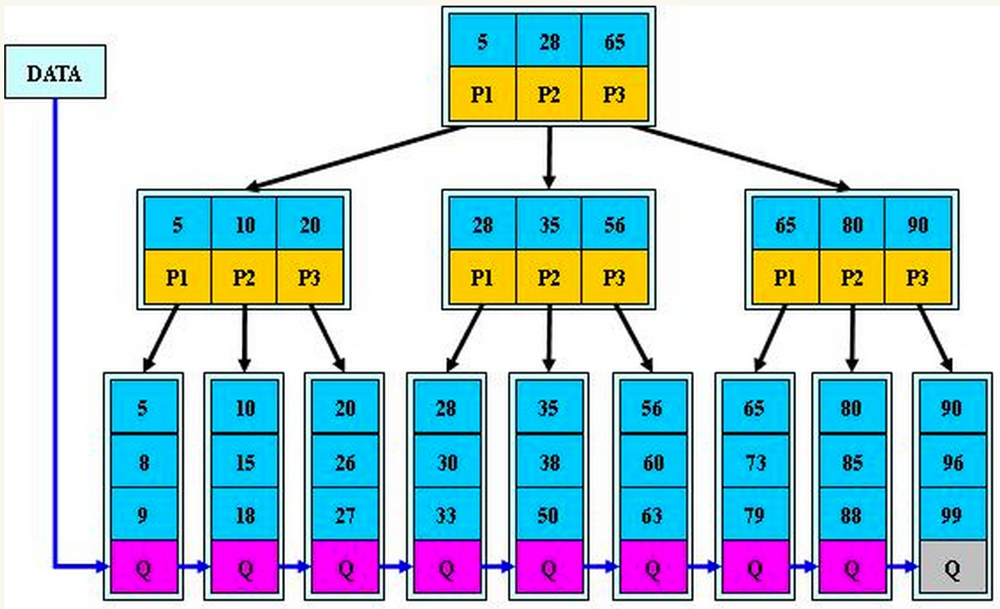

 #+TITLE: MySql Index

 #+KEYS: mysql,index

 #+DATE: <2015-04-28 Tue>

 #+AUTHOR: Chen Sun

 #+description: 建立索引能够加快查询速度，但是太多索引会造成磁盘和插入时的负担，如何为数据表选择适合的索引？如何使用MySql自带的性能分析工具？

##Terms##
* 聚簇索引：物理上根据此索引排列，在range查询时很快.一张表只能有一个聚簇索引

* 复合索引：多列组合的索引

* 左前缀匹配原则：索引就像电话号码簿一样.比如先以姓作为索引，其下按照名做索引.我们能够根据姓的索引快速找到所有姓‘张’的人.但是无法根据‘名’去快速查找所以名为‘张’的人.以（A,B,C,D）建索引，只有当查询query和索引左匹配比如A,B,C或A,B等时，能够用此索引. A,D或C,D查询时无法使用该索引.

* B+树：多路搜索树. Mysql使用它作为索引的数据结构. 其查找过程：
    1. 节点内二分查找，确定下一个查找的子节点
    2. 重复一，直到找到叶子节点. 叶子节点包含相邻节点指针，便于range查询



##Tools##
###explain###
mysql自带命令，用于分析query的查找效率
```sql
mysql> explain select * from A where price_listing_id=15 and suburb='richmond' and postcode=3121 and state='vic' and brand='residential' and channel='Rent' \G;
*************************** 1. row ***************************
           id: 1
  select_type: SIMPLE
        table: A
         type: ref
possible_keys: A_index2,A_id_fk
          key: A_id_fk
      key_len: 4
          ref: const
         rows: 951278
        Extra: Using where
1 row in set (0.26 sec)
```

* `possible_keys` : 所有候选的索引
* key: 该查询使用的索引
* rows: 遍历的行数; **这是优化查询的重要指标**

为query建立索引
```
create index multi_index on A(price_listing_id,suburb,postcode,state,brand,channel);
```
再次explain
```
*************************** 1. row ***************************
           id: 1
  select_type: SIMPLE
        table: A
         type: ref
possible_keys: A_index2,A_id_fk,multi_index
          key: multi_index
      key_len: 262
          ref: const,const
         rows: 35
        Extra: Using index condition
```
添加索引后，rows从<span style='color:red'>951278</span>降到35.

**值得一提的是在MyISAM引擎下, rows是参考值, 可能会出现rows比最终结果记录少的情况**

###profiles
profiles是mysql自带的. 会给出查询所耗时间, 借此查找慢查询. 这里要注意cache的影响.

* 打开profile: ```SET profiling = 1```;

* 执行如果查询命令后, 查看profile数据: ```SHOW PROFILES```;
```
mysql> SHOW PROFILES;
+----------+------------+---------------------------------------------------------------------------------------------------------------------------------------------------------------------------------------------------------------------+
| Query_ID | Duration   | Query                                                                                                                                                                                                               |
+----------+------------+---------------------------------------------------------------------------------------------------------------------------------------------------------------------------------------------------------------------+
|        1 | 0.52419150 | select * from A use index(A_id_fk) where price_listing_id=15 and suburb='richmond' and postcode=3121 and state='vic' and brand='residential' and channel='Rent' |
|        2 | 0.00046875 | select * from A use index(multi_index) where price_listing_id=15 and suburb='richmond' and postcode=3121 and state='vic' and brand='residential' and channel='Rent'                              |
+----------+------------+---------------------------------------------------------------------------------------------------------------------------------------------------------------------------------------------------------------------+
2 rows in set, 1 warning (0.27 sec)
```

**PS: show create table A, 能够查看表A的创建(包括索引)的语句**

##SQL优化
###查询时MySql如何选择索引
* 如果query里的所有列都在索引列，索引列的顺序就不重要了.比如建立索引(A,B,C), 则 "A=1 AND B=2 AND C=3" 以及 "C=3 AND B=2 AND A=1" 都能使用索引(A,B,C)

* 如果query里面的列部分出现在索引列，则遵循最左匹配原则.比如建立索引(A,B,C), 则 "B=2 AND C=3" 无法使用索引. "A=1 AND B=2" 能够使用索引

**所以要么改query中查询列的顺序, 要么改索引的顺序**

###建索引的一些原则
- 选择哪些列作为索引
  要分析查询的query.比如大多数query都含有A、B、C，那就考虑建立(A,B,C)的联合索引.

- 选择基数大的列作为索引
  基数表示的是该列对表中记录的区分度. 可用以下公式计算列A的基数
  ```count(distict(A))/count(*)```

- 索引顺序
  前面已经提到在查询时选择哪一个候选索引，是依据最左匹配原则。如果query中经常出现"A=2 AND B=1 AND C=5" 且经常出现"B=3"，则选择建立索引(B,A,C)


- 尽量扩展索引，而不是添加新索引
  建立索引的好处是加快查询速度，负面影响是磁盘占用(保存索引)和表插入时效率下降. 所以索引并不是越多越好